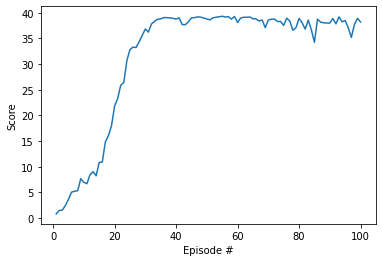

# Continuous Control of a Double-Jointed Arm


## Learning Environment

Controlling a double-jointed arm requires controlling a continuous action space, and in this respect, policy gradient methods are a natural choice.

More specifically, in this work, Deep Deterministic Policy Gradient (DDPG) solves the problem quite efficiently.
Deep Deterministic Policy Gradient (DDPG) is an algorithm which concurrently learns a Q-function and a policy. It uses off-policy data and the Bellman equation to learn the Q-function, and uses the Q-function to learn the policy.

In short, as reported [here](https://spinningup.openai.com/en/latest/algorithms/ddpg.html), DDPG:
- is an off-policy algorithm.
- can only be used for environments with continuous action spaces.
- can be thought of as being deep Q-learning for continuous action spaces.


In this implementation, the policy network is implemented through a simple network:

```
self.fc1 = nn.Linear(state_size, fc1)
self.fc2 = nn.Linear(fc1, fc2)
self.fc3 = nn.Linear(fc2, action_size)
```

where state_size=33, fc1=128, fc2=256, action_size=4.
Each linear layer is followed by a ReLU activation function, except for the last one which uses a tanh to constrain the action values to the correct range.

The Q-function network in this implementation uses the same architecture, except for the last linear layer that has no non-linear activaction after it and is used to directly output the q-values.


## Hyperparameters

```
BUFFER_SIZE = int(1e6)  # replay buffer size
BATCH_SIZE  = 128       # minibatch size
GAMMA       = 0.95      # discount factor
TAU         = 1e-3      # for soft update of target parameters
LR_ACTOR    = 1e-4      # learning rate of the actor 
LR_CRITIC   = 1e-3      # learning rate of the critic
WEIGHT_DECAY = 0        # L2 weight decay
UPDATE_EVERY = 20       # how often to update the network

UPDATE_EVERY  = 20       
REPLAY_EVENTS = 7      # update the networks for these many times.
```


## Results

The environment is solved in NNN episodes, with an average score of NNN over 100 episodes.





## Future Work

Implementing a prioritized experience replay can improve stability making it possible to train with less episodes. Not much hyperparameter tuning has been done. There is certainly some work that can be done here to improve it.
Alternative methods to DDPG could be implemented and their performance compared. [Proximal Policy Optimization (PPO)](https://openai.com/blog/openai-baselines-ppo/#ppo) strikes a balance between ease of implementation, sample complexity, and ease of tuning and usually outperforms A2C and A3C on most continuous control environments.